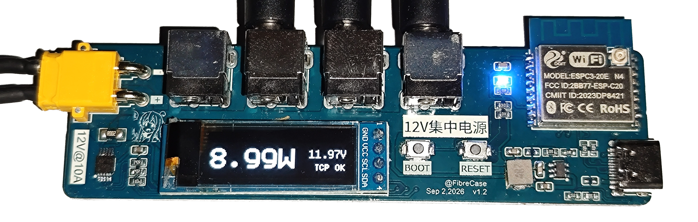
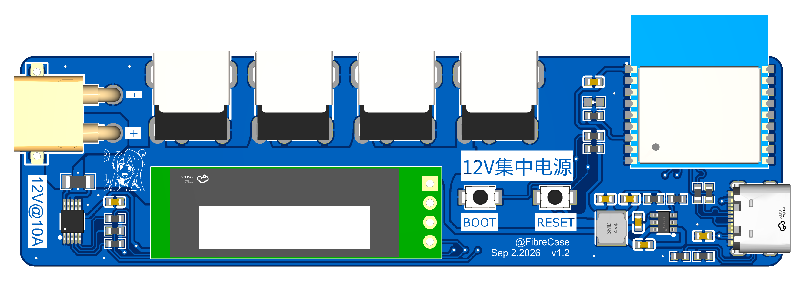

# 12V 供电动态采样监测系统（dynamic-power-monitor）

[English](README.md) | [中文](README_zh.md)

基于 **ESP32-C3** 的 **12 V 供电 / 电源分配实时监测**系统。固件读取 **INA226**
电流/功率传感器，把读数显示在 **128×32 SSD1306 OLED** 上，并通过一条长连接 TCP
把采样数据推送到 Python 后端；后端持久化到 SQLite，再通过 WebSocket + HTTP 提供
给浏览器监控面板。系统支持**空中固件升级（OTA，双槽 + 自动回滚）**和**过流告警
（OCP，含 Web 异常日志）**。

> **硬件：** [OSHWHub — 12V 供电动态采样监测系统](https://oshwhub.com/fibrecase/project_mfgowtnz) — 设计文件在嘉立创 EDA。

| 硬件 | 固件 | 监控面板 |
|---|---|---|
|  | ESP-IDF v6.0.1 |  |



## 功能特性

- **实时功率遥测** —— 母线电压（V）、电流（A）、功率（W），被查看时最高 **10 Hz**，空闲时降到 **0.1 Hz** 以省电、省流量。
- **板载显示** —— 128×32 SSD1306 OLED（u8g2 驱动），在设备本体上直接显示功率 / 电压 / 链路状态。
- **浏览器面板** —— 四个页签：**实时监控**（实时曲线）、**历史查询**（历史数据）、**异常日志**（过流/OCP 记录）、**固件更新**（OTA）。
- **SQLite 历史** —— 每条采样都会持久化，可按时间范围查询。
- **OTA 升级** —— 通过空中方式把新固件刷入第二个 Flash 槽；若新镜像启动失败，自动回滚。
- **过流告警（OCP）** —— 两条独立检测路径（INA226 **ALERT** 引脚 *和* 后端阈值）记录事件时间 + 当时的电压/电流/功率；在 **异常日志** 页查看。
- **自适应采样** —— 只有当有面板查看者在线时，设备才提升到 10 Hz；最后一个查看者离开后降回 0.1 Hz。

## 系统架构

三个相互独立的部分：

1. **固件**（仓库根目录 `main/`）—— ESP32-C3，ESP-IDF（C），目标 `esp32c3`。通过 I²C 读取 INA226、驱动 OLED，并持有 TCP 连接。
2. **后端**（`python/`，git **子模块**）—— Python（`uv`），FastAPI + 异步 TCP 接收 + SQLite 持久化 + WebSocket/HTTP 接口。
3. **监控面板**（`python/web/`）—— React + Vite + ECharts 单页应用，构建为静态资源后由后端直接托管（同源，无需 CORS）。

```
┌─────────────┐   TCP 20 字节采样 / 25 字节 OCP 事件        ┌──────────────────────┐
│  ESP32-C3   │ ─────────────────────────────────────────▶│   Python 后端         │
│  + INA226   │ ◀───────────────────────────────────────── │ （FastAPI, SQLite）  │
└─────────────┘   8 字节控制帧（采样间隔 / OTA）           └──────────┬───────────┘
        │   OLED（本地显示）                                       │
        │                                                       │ WS（实时）+ HTTP（历史/OTA/OCP）
        └──────────────────────────────────────────────▶  浏览器监控面板（React/Vite/ECharts）
```

完整线协议、任务划分与设计约束见 [`CLAUDE.md`](CLAUDE.md)。

## 仓库结构

```
.
├── main/                  # ESP32-C3 固件（ESP-IDF 组件）
│   ├── app_main.c         #   组合根：NVS → I2C → OLED → INA226 → WiFi → NTP → 启动任务
│   ├── core.{h,c}         #   跨任务共享状态（读数、采样间隔、事件队列、互斥锁）
│   ├── net_task.{h,c}     #   TCP：连接状态机、控制帧解析、采样/事件发送
│   ├── sample_task.{h,c}  #   按自身周期读取 INA226 并广播
│   ├── display.{h,c}      #   OLED（u8g2）：开机帧 + 实时帧
│   ├── status.{h,c}       #   状态 LED + INA226 ALERT 引脚（OCP 边沿 → 事件）
│   ├── wifi_ntp.{h,c}     #   WiFi STA + NTP 时钟同步
│   ├── ota_update.{h,c}   #   OTA 客户端（下行 cmd=0x02 → 下载 + 重启）
│   ├── ina226.{h,c}       #   INA226 驱动（校准、OCP 阈值、64/512 平均）
│   ├── u8g2_esp_hal.{h,c} #   u8g2 <-> ESP-IDF I2C 适配（SSD1306 OLED）
│   └── config.h           #   被 git 忽略；config.h.example 的副本（含 WiFi 凭据）
├── components/u8g2/       # git 子模块：u8g2 图形库（锁定 2.37.1）
├── assets/                # README 图片（实物照片、PCB 渲染图、面板截图）
├── partitions.csv         # 自定义双 OTA 槽分区表（见 OTA）
├── sdkconfig.defaults     # 选用 partitions.csv + 启用 app 回滚
├── CMakeLists.txt         # 顶层 ESP-IDF 工程
└── python/                # git 子模块：Python 后端（含 web/ 面板）
```

## 硬件

硬件已在 [OSHWHub](https://oshwhub.com/fibrecase/project_mfgowtnz) 开源
（设计文件在嘉立创 EDA / JLCEDA 中）。设备是一块自制 PCB，作为一个小型
**12 V 电源分配 + 监测**节点：一个 DC 输入，经 4× 12V 端子块分配给负载，INA226
测量所有负载的总电流。

主要器件：

- **ESP32-C3-02E** —— MCU + WiFi（内置 USB-Serial-JTAG，用于串口 / 烧录）。
- **INA226** —— 双向电流/功率传感器，串接低阻采样电阻；I²C 地址 `0x40`。
- **128×32 SSD1306 OLED** —— I²C（地址 `0x3C`），与 INA226 共用 I²C 总线。
- **DC 输入**（XT60 式）+ **4× 2P 端子**，用于 12 V 负载。
- **状态 LED**、**BOOT** / **RESET** 按键、**USB** 口。

固件 ↔ 硬件映射（均在 `main/config.h` 中）：

| 信号 | GPIO | 说明 |
|---|---|---|
| I²C SDA / SCL | GPIO4 / GPIO5 | 共享总线：INA226 + OLED，内部上拉 |
| 状态 LED | GPIO8 | 推挽、高电平点亮（闪烁速率 = WiFi / 采样模式） |
| INA226 ALERT | GPIO3 | 开漏、低电平有效（过流比较器） |
| USB-Serial-JTAG | GPIO18 / GPIO19 | 内置 —— 请勿占用 |

## 固件

需要 ESP-IDF（本仓库使用 **v6.0.1**）。先导出环境，再构建：

```bash
source $IDF_PATH/export.sh
idf.py set-target esp32c3     # 仅需一次
idf.py build
idf.py -p PORT flash monitor
```

烧录前，复制配置模板并按你的板卡 / 网络修改：

```bash
cp main/config.h.example main/config.h   # 然后编辑 main/config.h（被 git 忽略）
```

在 `main/config.h` 中设置 `CFG_*` 宏：WiFi SSID/密码、主机 IP/端口、NTP 服务器、I2C
引脚、INA226 的 `CFG_MAX_CURRENT_A` / `CFG_SHUNT_OHM`（采样电阻决定所有电流与功率读数），
以及 `CFG_OCP_THRESHOLD_A`（过流告警阈值，默认 **2.5 A**）。

## OTA（固件更新）

固件把自身通过空中方式更新到第二个 Flash 槽并重启进入新镜像，使用 ESP-IDF 内置的
**双槽 OTA + app 回滚**：新镜像启动并自检成功则保留；启动失败则引导程序自动回滚到
上一个镜像 —— 一次坏掉的升级不会把部署中的设备刷成砖。

自定义分区表（`partitions.csv`，无 `factory`）：`nvs` 0x9000、`otadata` 0xf000、
`phy_init` 0x11000，然后 `ota_0` 0x20000 与 `ota_1` 0x1d0000（各 1700K）。新应用默认
落在 `ota_0`；`app_main` 在健康启动后将其标记为有效。请确保 `.bin` 远小于单个槽
（约 1.65 MB；当前构建约 980 KB）。

**发布一次升级**（面板驱动）：
1. `idf.py build` → `build/esp32-power-monitor.bin`。
2. 面板 → **固件更新** → 选择 `.bin`（"选择 .bin 固件"）—— 上传到后端（`POST /ota/upload`），并托管在 `/ota/firmware.bin`。
3. 点击 **推送到设备**。后端经 TCP 发送 OTA 命令，设备下载并重启。该按钮仅在"已上传固件 *且* 设备在线"时可用。

## 过流告警（OCP）

两条独立的检测路径都会把过流事件记录到后端，并可在面板的 **异常日志** 页查看：

- **设备（硬件）** —— INA226 的 **ALERT** 比较器在电流超过 `CFG_OCP_THRESHOLD_A`
  （默认 2.5 A）时拉低 ALERT 引脚。固件在上升沿做一次新的 INA226 读取，并通过 TCP
  推送一个 25 字节的 OCP 事件帧。
- **后端（阈值）** —— 后端独立判断：采样电流超过 `PM_OCP_THRESHOLD_MA`
  （默认 2500 mA）时，在上升沿记录一次事件。

每条事件都保存**发生时间**以及当时的**电压 / 电流 / 功率**；两条路径用 `source`
字段区分（`device` / `host`）。

## 后端

```bash
cd python
uv sync
uv run power-monitor
```

- **TCP 接收** 监听端口 `38888`（ESP32 连接到这里；把固件的 `CFG_HOST_IP`/`CFG_HOST_PORT` 指向本机）。
- **`ws://<host>:38000/ws`** —— 实时采样广播。第一个查看者上线时设备切到 10 Hz，最后一个离开时降回 0.1 Hz。
- **`GET /api/v1/history?start_ts=&end_ts=&limit=`** —— 持久化采样，按时间降序。
- **`GET /api/v1/alerts?start_ts=&end_ts=&limit=`** —— 过流事件，按时间降序。
- **`GET /healthz`** —— `{"status", "device": <bool>, "viewers": <int>}`。
- **`GET /`** —— 面板（构建后）。

配置通过 `PM_*` 环境变量完成 —— 详见 [`python/README.md`](python/README.md)。

## 监控面板

React + Vite + ECharts 单页应用（`python/web/`），四个页签 —— **实时监控**（实时曲线）、
**历史查询**（历史数据）、**异常日志**（OCP 记录）、**固件更新**（OTA）。由后端直接
托管，同源，因此生产环境无需单独进程或 CORS。

```bash
cd python/web
npm install
npm run build        # 输出到 python/web/dist/，由 FastAPI 在 "/" 处托管
```

开发时可对着一个运行中的后端跑热更新：

```bash
cd python/web
npm run dev          # http://localhost:5173，代理 /api、/ws、/healthz、/ota -> :38000
```

## 端到端测试

后端自带一个无需硬件的端到端测试（假 ESP32 走 TCP + WebSocket 查看者），覆盖帧重组、
实时广播、采样间隔控制、历史、OTA 以及两条 OCP 检测路径：

```bash
cd python
uv run python -m tests.e2e
```

---

*ESP32-C3 / INA226 / SSD1306 —— [dynamic-power-monitor](https://github.com/FibreCase/dynamic-power-monitor)。*
